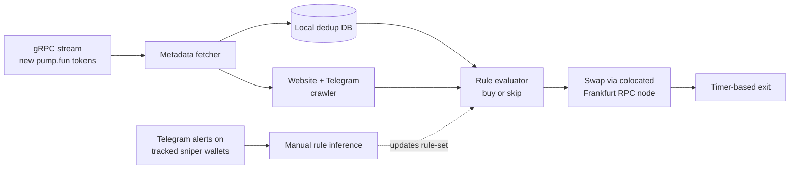

# Pump.fun algorithmic trading: retrospective (Feb-Apr 2024)

From February to April 2024 I ran a solo algorithmic trading system on pump.fun (Solana) and grew 7 SOL to about 1,000 SOL. The edge came from inferring which new tokens the dominant sniper bots would buy. The write-up covers rule inference, the execution stack and why the edge decayed.

**Tech:** Node.js · @solana/web3.js · Anchor · Yellowstone gRPC · on-chain transaction building 

*Personal retrospective. Figures are self-reported from my own records. No code is included. Not financial advice.*

## Summary

I started within weeks of pump.fun's January 2024 launch and grew the account roughly 143× in SOL terms. By then most early trading on new launches came from automated sniper bots, and that bot flow was the market I traded.

The edge wasn't sniping new launches in the usual sense. It was a second-order meta-strategy on the sniper ecosystem itself. I reverse-engineered the filtering rules the dominant sniper bots used to pick new tokens, and traded the launches my model said they would select. Their rule-set went through roughly eight identifiable stages over the three months, and my predictive model co-evolved with it.

In late April 2024 the edge decayed. Per-attempt economics went negative (0.01-0.3 SOL losses, degrading win rate) as the sniper cohort got sophisticated enough that my solo manual research workflow could no longer reverse-engineer their filters in real time. So I stopped. No point grinding a dead edge.

## Headline metrics

- Period: February 2024 through end of April 2024 (~3 months profitable operation)
- Starting capital: 7 SOL
- Ending capital: ~1,000 SOL (~143× in SOL terms)
- Peak working capital on hot trading wallet: ~100 SOL (rest held aside from active trading as balance grew)
- Trade volume: roughly 50 trades a day (~5,000 trades, ~2,500 round trips)
- Win rate: very high during the profitable phase; effectively no losing days until the terminal decay window
- Exit: wound down when the edge decayed below profitability; competitor sophistication had moved past what solo manual research could track

---

## Market context

Pump.fun launched on Solana in January 2024 as a fair-launch token creation platform. Anyone could deploy a new token in under a minute for less than $2, with instant trading available in a bonding-curve pool from the moment of creation.

Within weeks the platform attracted a large, visible population of automated sniper bots operating on one of two patterns:

1. Blind snipers. Buy every new token meeting a minimum filter (e.g., has metadata, has social links), size uniformly, exit on a short timer or price target.
2. Filter snipers. Apply increasingly sophisticated heuristics to distinguish legitimate launches from the overwhelming majority that were pre-planned rug-pulls.

By February 2024 the game was effectively two-sided: token creators (a large fraction of whom were predatory "serial ruggers" recycling wallets, websites, and branding across many launches) versus sniper bots trying to filter out the rugs fast enough to catch the launches that got organic traction.

A third position existed that almost nobody was occupying. Don't try to predict which tokens would succeed. Model which tokens the *snipers* would buy, and trade on that prediction.

The observation that made this viable was simple. Sniper decision rules weren't invisible. They were inferable from on-chain behavior: which launches the known bot wallets hit, which they skipped, and how fast. Close enough to trade on, at least for the dominant cohort.

That opportunity existed within a narrow window (roughly February through April 2024) before the bot ecosystem's sophistication outpaced solo manual research.

---

## Research methodology

The edge was discovered and maintained through a manual observation workflow. No ML, no automated feature inference. The research pipeline that fed the trading system was:

**Pattern discovery (manual).** I spent substantial time monitoring pump.fun's launch feed directly, far more time than was scalable. The signal I was looking for was *starting velocity*: new tokens that attracted immediate buy-pressure in the first seconds after creation. Starting velocity identified which tokens the bots had chosen to hit.

**Wallet attribution (semi-manual).** Tokens with starting velocity were traced back to the wallets responsible. Recurring wallets across many launches were candidates for "active snipers." Wallets matching a known pattern (e.g., shared address prefix, recognizable historical trade patterns) were already labeled. Unknown wallets appearing repeatedly got cross-referenced on Solscan. Full historical trade review on that wallet. From there I decided whether they represented a sniper worth monitoring or a one-off account.

**Real-time tracking (automated).** Sniper wallets passing the attribution filter were added to a Telegram alerting bot configured to notify me on every subsequent buy and sell by any tracked wallet, along with the contract address of the token involved. This produced a live, wallet-keyed activity feed of competitor behavior.

**Rule inference (manual).** With live data on which tokens the known snipers bought versus skipped, I could infer at each point in time what features the dominant sniper rule-sets were using. When the shared filter shifted (see the stages below), the shift was visible in the Telegram feed within hours. Known snipers would start buying a new feature profile, or start skipping tokens they would previously have hit.

So: manual pattern discovery, systematic on-chain wallet tracking, automated alerting, manual rule inference. The bottleneck was manual time on the discovery and inference steps.

---

## The evolving sniper rule-set

The snipers got better on two axes at once: filter sophistication (which features the snipers used to decide whether to buy), and execution latency (how fast they could detect and hit a qualifying launch). Both tightened over the three profitable months. My edge required staying ahead on both.

### Filter evolution

The sniper collective's filter evolved through roughly eight identifiable stages. Each one showed up in the Telegram tracking feed within hours.

**Stage 1. Wallet blocklist.** Snipers maintained blocklists of known rugger wallet addresses and skipped launches from those deployers. Effective for about a week; serial ruggers rotated wallets faster than the blocklists could update.

**Stage 2. Transitive fund-flow tracking.** Snipers began using tools that traced rugger capital through intermediary wallets. If a fresh deployer wallet was funded by a known-bad actor (even two or three hops upstream), it was marked poisoned and skipped. Substantially harder for ruggers to defeat than simple wallet blocklists.

**Stage 3. Metadata-presence filter.** Snipers required tokens to have a description populated.

**Stage 4. Social-link filter.** Required a linked social account (Twitter / Telegram / website).

**Stage 5. Historical uniqueness filter.** Snipers began rejecting tokens whose metadata (name, image, description) closely resembled previously launched tokens, defeating copy-paste rugs.

**Stage 6. Social media activity filter.** Snipers began programmatically checking linked accounts for non-trivial activity (follower count, post history, engagement) before buying. Freshly-created zero-activity Twitters got filtered out.

**Stage 7. Account-reuse filter.** Known-bad Twitter handles and social accounts from prior rug launches were tracked and filtered on reuse.

**Stage 8. Website fingerprinting.** Snipers began fingerprinting the underlying website templates themselves, detecting reuse even when token name, description, and branding were rotated.

### Speed evolution

Independently of the filter axis, sniper execution latency tightened steadily over the period. In February 2024 I was among the faster actors in the ecosystem (helped by a server colocated with a private RPC node in Frankfurt; see Architecture and execution stack). By late April I'd fallen off the speed frontier. Competitors were consistently landing transactions ahead of mine on qualifying launches, even when my signal generation was correct. Recovering the speed edge would have required a different infrastructure tier: my own Solana nodes with custom transaction submission pipelines, which I didn't build.

### My role in this sequence

At each filter stage, once the shift was detectable in the Telegram feed, I replicated the new sniper filter in my pipeline and positioned *one inference step ahead*. The system evaluated new launches against the current (predicted) sniper rule-set, entered positions on launches I expected snipers to buy, and exited on a short fixed timer.

This worked when I was ahead on filter inference and competitive on latency. By late April 2024 both advantages had eroded. I was inferring filters correctly but arriving late, and the most sophisticated sniper tier had moved to a filter layer my manual research process could no longer reverse-engineer in real time.

### What I implemented vs. what I predicted

Stages 1 through 5 (wallet blocklist, fund-flow tracking, metadata presence, social-link presence, historical uniqueness) were directly replicable in my pipeline. All inputs were available from on-chain data or token metadata.

Stages 6 through 8 (Twitter activity, Twitter account reuse, website fingerprinting) relied on data sources that were either expensive or operationally fragile for a solo researcher in early 2024. Twitter's API had been paywalled since March 2023 and unauthenticated scraping was heavily restricted. I didn't run these filters directly. Instead, I scraped websites and Telegram channels (both accessible via free, stable APIs) as cheap proxies, and relied on the snipers themselves to apply the expensive Twitter-based filters. My edge came from predicting *which* launches the snipers would buy under their current rule-set, not from independently verifying each launch against that rule-set.

### Epistemic caveat

These eight stages are what was observable to me from the Telegram feed and manual research workflow. The real picture was almost certainly more complex. The most sophisticated operators likely ran filter layers I couldn't reverse-engineer from public on-chain data. My edge operated at the level of the dominant, observable sniper cohort, not the frontier.

---

## Architecture and execution stack

The trading path ran automatically on every new launch. The research loop feeding it (dotted edge) was manual: a separate Telegram alert consumer showed what tracked sniper wallets bought, and I updated the rule evaluator by hand when their filters shifted.

The system was written in JavaScript. Rationale at the time: Solana's first-class client libraries (@solana/web3.js, Anchor clients) were JS-native and I could move fastest in that ecosystem without paying a type-system tax. In retrospect, TypeScript would have been the better choice. The project ran for three months and had enough state complexity across the metadata fetcher, local DB, crawler, and trade executor to justify the type system. I wasn't yet familiar with TS at the start, and by the time a migration would have been worth it, the edge was already decaying.

### Pipeline

1. gRPC launch subscription. Real-time gRPC stream from a Solana node, filtered to pump.fun's program account for new-token-creation events. Lower latency than polling the RPC over HTTP. Essential for the speed axis of the race.
2. Metadata fetcher. On each new-token event, fetch the token's metadata record (name, image, description, socials).
3. Local deduplication DB. Write every observed launch to a local database for downstream similarity checks (Stage 5 filter, historical uniqueness).
4. Website and Telegram crawler. Fetch linked website content and linked Telegram channel activity. Twitter wasn't directly scraped. Twitter API had been paywalled since March 2023 and unauthenticated scraping was operationally fragile, so Twitter presence was recorded as a boolean feature but not inspected for activity or reuse.
5. Rule evaluator. Apply the current inferred sniper rule-set. Decide buy or skip.
6. Transaction submission. Swap buy from a server colocated with a private Solana RPC node in Frankfurt, chosen for low-latency transaction propagation to the Solana network.
7. Timer-based exit. Each position had a configured exit delay. Position closed at timer expiry regardless of price.
8. Telegram alert consumer (separate process). Real-time feed of tracked-wallet buys and sells from the Telegram bot, used for ongoing rule inference, not as a direct trading signal.

### Infrastructure notes

- Colocated Frankfurt RPC node. The bot ran in the same datacenter as its private RPC node, chosen for network proximity to a large fraction of Solana validator nodes. This gave a meaningful latency advantage over public RPC endpoints in early 2024. By late April the frontier had shifted to operators running their own nodes with custom submission paths, and a rented RPC node was no longer sufficient.
- Twitter data treated as exogenous. I relied on the snipers (who could afford paid API access) to apply Twitter-based filters. This constrained the signal layer I could operate on but was a correct cost/benefit call for a solo operator.
- No failover, no metrics, no logging beyond ad-hoc. Intentional. The edge had a limited expected lifetime and I deliberately didn't invest engineering effort that wouldn't pay off before the edge decayed. When daily PnL turned from consistent positive to consistent negative in late April, the signal was obvious without metrics.

---

## Trading logic, sizing, risk

### Position sizing

Per-trade notional was 0.6 to 2 SOL. The range was calibrated to two constraints:

1. Pool liquidity. Pump.fun launches had thin initial liquidity (bonding-curve pools with minimal starting capital). Larger orders would both move the pool against me on entry and fail to fill cleanly on exit.
2. Sniper liquidity preferences. Many tracked snipers had their own liquidity filters. Some would only buy if the pool held ≤X SOL. Sizing had to respect those limits, or the token would no longer match the profile the model was predicting.

Entry size on each trade was a function of the creator's initial buy and the liquidity profile the tracked snipers were known to accept.

### Concurrency: single position at a time

The script ran one active position at a time. No concurrent positions, no position-queuing, no parallel executor. A rudimentary single-threaded loop. Not worth dressing up.

This was acceptable because of two characteristics of the strategy:

1. Short hold times. Typical hold per position was under 10 seconds (entry, sniper buy-in confirmation, timer exit). At roughly 50 trades a day this meant position turnover was fast, and concurrency would have added marginal throughput rather than unlocking meaningfully more opportunity.
2. Per-position liquidity constraint. Total scalable capital was bounded by per-position size (0.6 to 2 SOL, limited by pool liquidity), not by how many positions could run in parallel. Adding concurrency wouldn't have raised the ceiling. It would have required re-architecting for little upside.

Missed opportunities during active positions were real but small in aggregate. At <10s holds and ~25 entries a day, the script was mostly idle waiting for the next qualifying launch, not blocked on concurrent trade management.

### Exit mechanism

Fixed timer per position. Each position was closed at a configured delay after entry, regardless of price. No price-target logic, no trailing stop, no bot-activity-conditioned exit.

Low-value to optimize. Per-trade size was small (0.6 to 2 SOL), win rate was very high during the profitable phase, and the strategy had an operational lifetime measured in months. Risk discipline was concentrated at the *entry* stage, at the signal/research/filter-inference layer, not at the exit stage.

### Rug protection

Per-trade size was the primary defense. Even on a complete rug (deployer dumps all liquidity), loss was bounded to 0.6 to 2 SOL. No stop-losses. The timer ran through rug events the same as any other, and a rugged position simply exited at near-zero. Over ~2,500 round trips, aggregate rug exposure was well within the edge generated by successful trades.

---

## Decay and decision to exit

### The decay signal

Through roughly the end of April 2024, per-attempt economics inverted:

- Daily PnL flipped from consistently positive to consistently negative.
- Per-attempt losses of 0.01 to 0.3 SOL replaced what had previously been a high-win-rate distribution.
- The entries my script generated were no longer being confirmed by the expected sniper buy-in at the expected rates.

I didn't need monitoring dashboards to detect this. When the account balance stops going up day-over-day and starts going down, the signal is unambiguous.

### Causes of decay

Two things happened in parallel. Both came from the sniper cohort as a whole getting better, not from one tier-above-me competitor emerging.

1. Filter-layer professionalization. The sniper collective, particularly its top-tier operators, became genuinely good at filtering. Their buy decisions were no longer predictable from public on-chain observation. The features driving their filters had moved past what I could reverse-engineer from a Telegram alert feed of their confirmed buys. Once I couldn't predict *which* launches the snipers would buy, the edge had no signal to act on.

2. Latency-layer professionalization. Sniper execution infrastructure tightened substantially over the period. In February my transactions were consistently among the first into qualifying launches. By late April I was landing late on an increasing fraction of attempts. Matching the new latency frontier would have required my own Solana nodes with custom transaction submission rather than a rented, colocated RPC node.

### Reference point: the top-tier sniper cluster

The most visible example of the top-tier sniper cohort was a small cluster of wallets (a handful, not dozens) that stood out consistently across launches. These weren't meta-players running a strategy like mine. They were elite snipers operating at the top of the sniper sophistication tier, with filter discipline well beyond what I could infer from public data. Seeing that tier of sniper exist, and perform that well, was what made the professionalization feel real to me.

### The decision

I wound down operations in late April 2024. The reasoning was straightforward. The edge had decayed to unprofitable, its decay was driven by structural professionalization of the counterparty, and recovering it would have required either moving beyond manual research to ML-based filter inference, or beyond solo-operator infrastructure to a team running its own node infrastructure. Neither was a reasonable near-term investment against an edge that had already closed.

---

## Lessons and retrospective

### 1. Solo monitoring was the binding bottleneck, not the system

The research pipeline (observation, wallet tracking, rule inference) depended on manual time on pump.fun and manual interpretation of Telegram alerts. Nearly all of my research bandwidth went to *staying current* with the existing rule-set rather than *evolving the system*. Even on the best days, the marginal hour went to monitoring, not to building the next layer.

The system was making money and I was the bottleneck. Someone owning just the wallet-monitoring layer would have freed my time for the next version.

I didn't do this, and the edge decayed before I had the opportunity to scale the research layer. Next time I'd bring someone in as soon as I noticed I was spending my days keeping up rather than building.

### 2. ML-based filter inference was the tier I didn't reach

Filter inference was manual throughout the project. I observed which launches the tracked snipers bought, compared feature profiles, and updated my rules by hand as the sniper rule-set evolved. This worked at early sniper sophistication and broke down at late sniper sophistication.

The next tier would have been automated. Train a classifier on (launch features, sniper-bought-yes/no) pairs, update it continuously as the Telegram feed produced new labels, and drive buy decisions off model output rather than hand-coded rules. That would have kept pace with Stage 6-8 filter evolution and possibly surfaced filter layers I couldn't infer manually.

I didn't have the ML background to build this at the time. It's the clearest answer to what would have kept the edge alive longer.

### 3. Infrastructure investment should match edge duration (but this is a ceiling, not a floor)

For a three-month edge, the minimum-viable infrastructure (JavaScript script, gRPC subscription, colocated Frankfurt RPC node, no failover, no metrics) was the correct engineering investment. Over-building would have wasted time against a known short-lived opportunity.

The same principle doesn't apply to a durable edge. The trading system I'm building now (see below) is scoped against edges with operational lifetimes in years rather than months. Smaller per-trade edges, competitive counterparties, real capital at risk. The infrastructure investment (strict typing, deterministic backtester, event-driven architecture, risk engine with hard gates, observability stack) is calibrated accordingly.

---

## What transferred

The pump.fun project ended in late April 2024. What carried forward to subsequent work, and what didn't:

### What transferred

- On-chain behavior modeling as a research method. Tracking specific actors and inferring their decision rules from what they do on-chain. It generalizes to any market where counterparty identity and behavior are partially observable.
- Instinct for new-venue alpha. New venues are inefficient for a while, and minimum-viable infrastructure is enough to trade them before that closes. The pump.fun edge itself was ephemeral. Spotting new venues early and building fast is the part that transfers.
- Solana operational knowledge. gRPC account subscriptions, RPC endpoint latency characteristics, Solana's 400ms block time, bonding-curve AMM behavior, MEV surface. All directly usable for subsequent Solana work.
- Edge-duration-matched engineering (lesson 3 above). It still drives how much I build around a strategy before trusting it.

### What didn't transfer

- The pump.fun-specific edge itself. Memecoin launch dynamics and sniper rule-evolution are specific to that venue and that period. I didn't attempt to revive the strategy in a modified form.
- The JavaScript stack. Subsequent work has been in Python with strict typing (`mypy --strict`), a reaction to the pump.fun stack's looseness, given that the next system is built for durability rather than speed-to-market.

### What I'm doing now

I'm building a multi-strategy Python trading framework ([architecture overview](https://github.com/jmenzler/trading-v1-overview)), used for tokenized-equity arbitrage across Solana DEXs with hedges on Hyperliquid and Alpaca. Deliberately a different regime from pump.fun: smaller per-trade edges, durable counterparties, real capital at risk, infrastructure sized for operational lifetime in years rather than months.

It runs on `mypy --strict`, event-driven pub/sub, a deterministic backtester with real pool-state replay, atomic dual-leg capital gates and a full observability stack, which is about as far from the pump.fun script as I could get.
